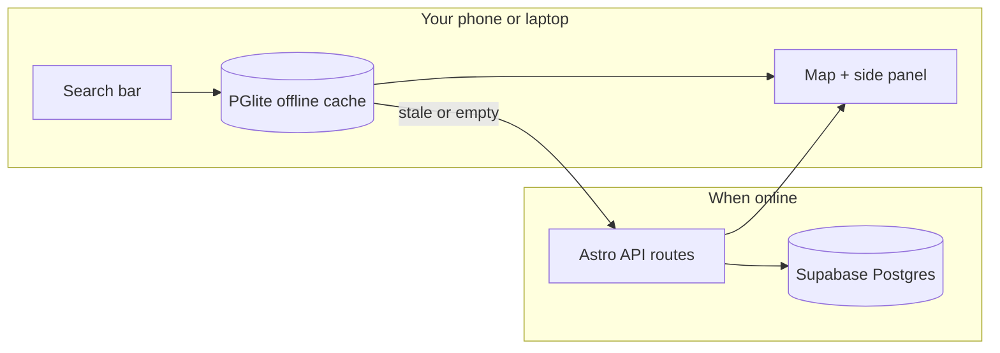
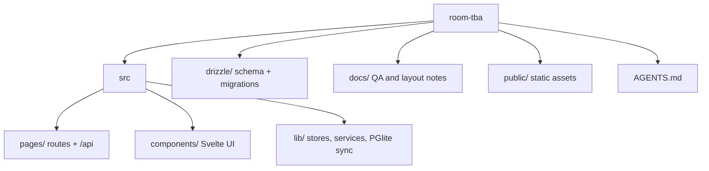

<div align="center">

# Room TBA

**Saan sa UPLB ang \___?**

[](https://room-tba.uplbtools.me)
[](LICENSE)
[](https://bun.sh)
[](https://astro.build)

_Schedules, buildings, jeepney routes, and "where is PSLH 1?" on one campus map._

[Open the map](https://room-tba.uplbtools.me) · [Wiki](https://room-tba.uplbtools.me/wiki) · [Report wrong data](https://github.com/uplbtools/room-tba/issues/new/choose) · [Changelog](https://room-tba.uplbtools.me/changelog)

</div>

---

## What this is

**Room TBA** is a map-first web app for [UPLB](https://uplb.edu.ph) students. You search a room code, building nickname, or course; the app puts it on an interactive campus map, shows schedules when we have them, and keeps working when the signal drops.

No account needed to browse. Editors and contributors fix data in the same app (login popup on the map, not a separate admin site).

> **Data note:** Room and class listings are updated each term by volunteers. The active term follows the academic calendar (midyear Jun–Jul, 2nd sem Jan–May, etc.). Schedules show **lecture and lab** sections with assigned rooms: thesis, special problem, dissertation, and similar sections usually are not tied to a room in AMIS. Wrong schedule? [Open an issue](https://github.com/uplbtools/room-tba/issues/new/choose).

---

## What you can do

| Goal | How |
| ----------------------------- | ---------------------------------------------------------------- |
| Find **PSLH 1** or **PhySci** | Search + aliases (`PhySci`, `HUM`, …) |
| Room schedule this sem | Term filter + timetable |
| Personal schedule route | Build a plan in Planner → Map tools → Schedule → pick a day, route stops |
| Browse all classes | Status bar → Browse classes; search by course code |
| Plan your classes | Planner view to build a draft schedule |
| Course Planner explainer | [Four-panel, screenshot-ready guide](https://room-tba.uplbtools.me/pubmat/course-planner/) |
| Final exam time & room | Search course code → finals panel; room panel during finals week |
| Building location | Map, pins, directions, Google Maps |
| Landmarks, services, orgs & offices | Sidebar directories, distinct map pins, and shareable detail links |
| Offline / bad signal | PWA + local cache; tiles if already loaded |
| Campus events | Events on map with routes |
| Jeepney routes | Route overlays |
| 3D view | Buildings + Makiling terrain (online) |
| Understand section names | Wiki guide to the A–H / S–Z class time blocks |

<details>
<summary><strong>Editor / contributor mode</strong> (password from the team)</summary>

| Power | Where |
| -------------------------------- | ---------------------------------------------------------------------------------------------------------------- |
| Move building & dorm pins | Map edit mode (pencil) |
| Add or correct landmarks, services, organizations, offices & units | **Add something to the map** or the side-panel editor; pick the map pin |
| Fix room/building/college copy | Side panel → Edit |
| Suggest edits without publishing | **Suggest an edit** → admin review queue |
| Upload event posters | Event editor + R2 image upload (when configured) |
| Manage public credit | Account settings → optional HTTPS avatar/profile link; uncheck credits to opt out |
| Undo a pin drag | Toolbar undo/redo (session); durable history tracked in [#202](https://github.com/uplbtools/room-tba/issues/202) |

Login: **`/?editor=login`** or the shield / status bar in the app. `/admin` URLs redirect back into the map.

</details>

---

## How a search works



1. **First visit online:** app syncs buildings, rooms, classes, aliases, and events into browser storage.
2. **You search:** local data first; network when sync keys say something changed.
3. **You pick a result:** map flies to the pin; side panel shows schedules, directions, and a share link.
4. **You go offline:** last sync still answers "saan ang room na 'to?" (map tiles need a prior download or visit).

---

## Stack

- [Astro 7](https://astro.build) + [Svelte 5](https://svelte.dev)
- [Bun](https://bun.sh)
- [Supabase](https://supabase.com) Postgres + [Drizzle](https://orm.drizzle.team) (`drizzle/`)
- [PGlite](https://pglite.dev) in the browser for offline data
- [MapLibre GL](https://maplibre.org), OSM / MapTiler tiles
- [Vercel](https://vercel.com) for SSR and API routes
- Cloudflare R2 for event uploads (optional)

Contributor notes: [AGENTS.md](AGENTS.md)

---

## Run it locally

### You need

- [Bun](https://bun.sh) 1.3+
- A **Supabase** Postgres URL (`DATABASE_URL`); session pooler recommended for dev
- `ADMIN_PASSWORD` if you want editor login locally
- `ISR_BYPASS_TOKEN` (optional locally; **required on Vercel** for on-demand SEO page revalidation after editor publishes)

### Setup

```sh
git clone https://github.com/uplbtools/room-tba.git
cd room-tba
cp .env.example .env.local
# Fill DATABASE_URL (staging pooler) and ADMIN_PASSWORD — see .env.example for prod/E2E URLs

bun install
bun dev
```

Open **http://localhost:4321**. Without `DATABASE_URL`, the dev server starts but pages that hit the DB will 500. That is expected.

### Linting and formatting

This project uses [Biome](https://biomejs.dev/) for both formatting and linting (replacing Prettier and ESLint).

```sh
# Check format + lint (no writes):
bun run lint

# Auto-fix all safe issues:
bun run lint:fix

# Format only:
bun run format
```

Install the [Biome VS Code extension](https://marketplace.visualstudio.com/items?itemName=biomejs.biome) for format-on-save support. The workspace settings in `.vscode/settings.json` configure this automatically.

### Commands worth knowing

| Command | Does what |
| --- | --- |
| `bun dev` | Dev server |
| `bun run build` | Production build (**needs** `DATABASE_URL`; entity SEO pages render on first request via Vercel ISR, not at build) |
| `bun test src/lib src/constants` | Unit + store tests (no DB required) |
| `bun run test:components` | Vitest component/layout tests |
| `bun run test:integration` | API + DB integration (E2E DB; see `docs/testing.md`) |
| `bun run e2e` | Playwright blocking suite (uses `serve:e2e`: node adapter build + preview) |
| `bun run e2e:advisory` | Playwright advisory (non-blocking in CI) |
| `bun run lint` | Biome check (format + lint) |
| `bun run lint:fix` | Biome check with auto-fixes |
| `bun run format` | Biome format write |
| `bunx drizzle-kit studio` | Browse/edit Postgres visually |
| `bun run seed:aliases` | Seed building aliases from `public/room_info.json` |
| `bun run seed:deep-research` | Fill-only data-gap seed from the 2026-07 research report (`DATABASE_URL`; `--dry-run` supported) |
| `bun run generate:pglite-schema` | Regenerate the offline PGlite init SQL from `drizzle/schema.ts` |
| `bun run import:osa-orgs` | Add the current public OSA organization directory (`DATABASE_URL`; safe to rerun) |
| `bun run import:campus-offices` | Add missing campus offices and units (`DATABASE_URL`; safe to rerun) |
| `bun run import:amis-classes` | Upsert AMIS classes (`docs/amis-com-refresh-runbook.md`) |
| `bun run import:final-exams` | Import OUR finals JSON into Postgres (`DATABASE_URL`; see `docs/final-exams-data-source.md`) |

Legacy **`data/info.db`** SQLite is only for old seed/export scripts (`bun:sqlite`, not runtime). Production uses Supabase Postgres via `DATABASE_URL`. Archived SQLite migrations live in `drizzle-migrations/`: do not edit; active schema is `drizzle/`.

Optional env vars (R2 uploads, Supabase Auth client): see [`.env.example`](.env.example).

---

## Repo map



Deep editor QA: [`docs/editor-foundation-test-plan.md`](docs/editor-foundation-test-plan.md) 
PR checklist: [`docs/agentic-qa-process.md`](docs/agentic-qa-process.md)

---

## Contributing

See **[CONTRIBUTING.md](CONTRIBUTING.md)** for how to help:

- **Report wrong data** or **campus QA:** no clone, no PR
- **Write code:** branch off `staging`, PR to `staging` ([developer guide](docs/developer-guide.md))
- **Maintainers / agents:** [AGENTS.md](AGENTS.md) · [agent tooling](docs/agent-tooling.md) (`bun run install:agent-tooling` + `install:agent-plugins` once per machine)

[Good first issues](https://github.com/uplbtools/room-tba/issues?q=is%3Aissue+is%3Aopen+label%3A%22good+first+issue%22) · **Data:** label `data` · **QA:** label `qa`

Implementers: [issue hygiene](docs/issue-hygiene.md) · [PR QA process](docs/agentic-qa-process.md)

---

## Releases

Version follows semver. Pushes to `main` run [semantic-release](https://semantic-release.gitbook.io/) (skip with `[skip ci]` in the commit message). The in-app status bar shows `vX.Y.Z` from `package.json`.

Dry run: `bun run release:dry`

---

## Credits

**Maintainer:** [Simonee Ezekiel Mariquit](https://stimmie.dev)

**Built with help from:**

| Person | Helped with |
| ----------------------- | -------------------------------------- |
| Ken Ramiscal | UI, offline support, map |
| Kalinaw Lukas Aom Bebis | UI, bug fixes, map |
| Niño Anthony Marmeto | Electrical Engineering building info |
| Rosh Almario | Institute of Chemistry room directions |
| Eunice Almeyda | Logo |
| Mary Gwyneth Telmosa | UI design |

Org: [uplbtools](https://github.com/uplbtools) · Campus tool, not an official UPLB product.

---

## License

[MIT](LICENSE). Use it, fork it, teach with it. If you deploy a fork for another campus, change the data, not just the logo.

---

<div align="center">

**[room-tba.uplbtools.me](https://room-tba.uplbtools.me)**

</div>
