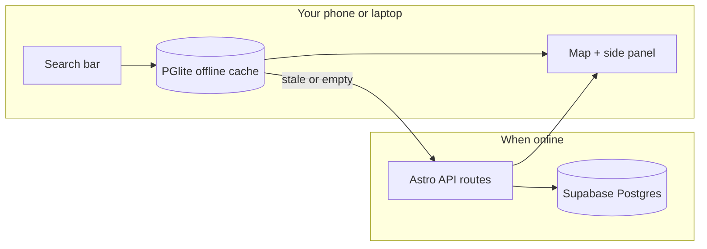

<div align="center">

# Room TBA

**Saan sa UPLB ang \___?** · Finally, a straight answer.

[](https://room-tba.uplbtools.me)
[](LICENSE)
[](https://bun.sh)
[](https://astro.build)

_Schedules, buildings, jeepney routes, and “how do I even get to CASA1” — on one campus map._

[Open the map](https://room-tba.uplbtools.me) · [Report wrong data](https://github.com/uplbtools/room-tba/issues/new/choose) · [Changelog](https://room-tba.uplbtools.me/changelog)

</div>

---

```
        Mt. Makiling
            ▲
            │     🚌 Jeepney routes (when you admit you’re lost)
            │
    ┌───────┴───────────────────────────────────┐
    │  UPLB · Los Baños                         │
    │                                           │
    │   [ Search: "PhySci" / "ICS 314" / … ]    │
    │              ↓                            │
    │         📍 pin on map                     │
    │              ↓                            │
    │   "Ah, *there*."                          │
    └───────────────────────────────────────────┘
            │
            ▼
     (still walk fast — class started 5 min ago)
```

## What this is

**Room TBA** is a map-first web app for [UPLB](https://uplb.edu.ph) students. You search a room code, building nickname, or course; the app puts it on an interactive campus map, shows schedules when we have them, and keeps working when the signal doesn’t.

No account needed to browse. Editors and contributors can fix data **inside the same app** (login popup on the map — not a separate admin dungeon).

> **Data note:** Room and class listings are updated each term by volunteers. Right now the default view targets **2nd Semester AY 2025–2026**. Wrong schedule? [Open an issue](https://github.com/uplbtools/room-tba/issues/new/choose) — that’s how the dataset gets better.

---

## What you can do (student mode)

| You want to…                         | Room TBA does…                                                                  |
| ------------------------------------ | ------------------------------------------------------------------------------- |
| Find **ICS 314** or **CASA1**        | Search + alias matching (`PhySci`, `HUM`, building nicknames)                   |
| See **who’s in that room this sem**  | Term-aware class schedules + timetable view                                     |
| Figure out **where the building is** | MapLibre campus map, pins, directions, Google Maps handoff                      |
| Survive **dead zones**               | PWA + offline cache (PGlite in the browser; map tiles after you’ve loaded them) |
| Check **events & org stuff**         | Campus events on the map with locations and routes                              |
| Ride the **jeep** without guessing   | Jeepney route overlays                                                          |
| Get **un-lost in 3D**                | Optional building view / terrain toward Makiling (online tiles)                 |

<details>
<summary><strong>Editor / contributor mode</strong> (password from the team)</summary>

| Power                            | Where                                                                                                           |
| -------------------------------- | --------------------------------------------------------------------------------------------------------------- |
| Move building & dorm pins        | Map edit mode (pencil)                                                                                          |
| Fix room/building/college copy   | Side panel → Edit                                                                                               |
| Suggest edits without publishing | **Suggest an edit** → admin review queue                                                                        |
| Upload event posters             | Event editor + R2 image upload (when configured)                                                                |
| Undo a pin drag                  | Toolbar undo/redo (session) — durable history coming ([#202](https://github.com/uplbtools/room-tba/issues/202)) |

Login: **`/?editor=login`** or the shield / status bar in the app. `/admin` URLs redirect back into the map.

</details>

---

## How a search actually works



1. **First visit online** — app syncs buildings, rooms, classes, aliases, events into browser storage.
2. **You search** — local data first; network when keys say something changed.
3. **You pick a result** — map flies to the pin; side panel shows schedules, directions, share link.
4. **You go offline** — last sync still answers “saan ang room na ‘to?” (map tiles need prior download / visit).

---

## Stack (for the curious)

| Layer     | Choice                                                                              | Why it’s here                                                 |
| --------- | ----------------------------------------------------------------------------------- | ------------------------------------------------------------- |
| App shell | [Astro 7](https://astro.build) + [Svelte 5](https://svelte.dev)                     | SEO pages for every room/building **and** a snappy map island |
| Runtime   | [Bun](https://bun.sh)                                                               | Dev speed, tests, installs                                    |
| Database  | [Supabase](https://supabase.com) Postgres + [Drizzle ORM](https://orm.drizzle.team) | Real relational data, migrations in `drizzle/`                |
| Offline   | [PGlite](https://pglite.dev) (`idb://site-data`)                                    | Actual SQL in the browser, not a sad JSON blob                |
| Maps      | [MapLibre GL](https://maplibre.org) + OSM/MapTiler                                  | Open tiles, no Mapbox invoice panic                           |
| Images    | Cloudflare R2 (optional)                                                            | Event uploads via `/api/admin/upload`                         |
| Host      | [Vercel](https://vercel.com)                                                        | SSR + API routes                                              |
| CI        | Prettier, unit tests, CodeQL, Dependabot                                            | See [AGENTS.md](AGENTS.md)                                    |

---

## Run it locally

### You need

- [Bun](https://bun.sh) 1.3+
- A **Supabase** Postgres URL (`DATABASE_URL`) — session pooler recommended for dev
- `ADMIN_PASSWORD` if you want editor login locally

### Setup

```sh
git clone https://github.com/uplbtools/room-tba.git
cd room-tba
cp .env.example .env
# Fill DATABASE_URL (and ADMIN_PASSWORD) in .env

bun install
bun dev
```

Open **http://localhost:4321**. Without `DATABASE_URL`, the dev server starts but pages that hit the DB will 500 — that’s intentional, not a haunted build.

### Commands worth knowing

| Command                   | Does what                                          |
| ------------------------- | -------------------------------------------------- |
| `bun dev`                 | Dev server                                         |
| `bun run build`           | Production build (**needs** `DATABASE_URL`)        |
| `bun test src`            | Unit tests (no DB required)                        |
| `bun run lint`            | Prettier + ESLint                                  |
| `bun run format`          | Prettier write                                     |
| `bunx drizzle-kit studio` | Browse/edit Postgres visually                      |
| `bun run seed:aliases`    | Seed building aliases from `public/room_info.json` |

Legacy **`data/info.db`** SQLite is only for old seed/export scripts — **not** what production runs on.

Optional env vars (R2 uploads, Supabase Auth client): see [`.env.example`](.env.example).

---

## Repo map

```
room-tba/
├── src/
│   ├── pages/          # Astro routes + /api/* endpoints
│   ├── components/     # Svelte UI (map, search, editor chrome)
│   └── lib/            # Stores, services, PGlite sync, Drizzle callers
├── drizzle/            # Postgres schema + SQL migrations (apply before deploy!)
├── docs/               # QA checklists, map layout matrix, issue hygiene
├── public/             # Static assets, basemap JSON, legacy room_info
└── AGENTS.md           # How agents & contributors should work in this repo
```

Deep editor QA: [`docs/editor-foundation-test-plan.md`](docs/editor-foundation-test-plan.md)  
PR checklist: [`docs/agentic-qa-process.md`](docs/agentic-qa-process.md)

---

## Contributing

We merge through GitHub. Rough flow:

1. **Find or file an issue** — implementation details live there; keep them updated ([`docs/issue-hygiene.md`](docs/issue-hygiene.md)).
2. **Branch off `staging`**, hack, run `bun test src` + Prettier.
3. **PR to `staging`** — template asks for QA evidence; CI runs Prettier + tests.
4. **Human pass** for map/editor UI at 320px if you touched chrome.

Commit messages: [Conventional Commits](https://www.conventionalcommits.org/) (`feat(map): …`, `fix(api): …`) — semantic-release uses them on `main`.

**Good first issues:** [good first issue](https://github.com/uplbtools/room-tba/issues?q=is%3Aissue+is%3Aopen+label%3A%22good+first+issue%22) · **Data fixes:** label `data` · **QA passes:** label `qa`

No separate admin dashboard — if you can view it on the map, you should eventually edit it there.

---

## Releases

Version follows semver. Pushes to `main` run [semantic-release](https://semantic-release.gitbook.io/) (skip with `[skip ci]` in commit message). The in-app status bar shows `vX.Y.Z` from `package.json`.

Dry run: `bun run release:dry`

---

## Credits

**Maintainer:** [Simonee Ezekiel Mariquit](https://stimmie.dev)

**Built with help from:**

| Person                  | Helped with                            |
| ----------------------- | -------------------------------------- |
| Ken Ramiscal            | UI, offline support, map               |
| Kalinaw Lukas Aom Bebis | UI, bug fixes, map                     |
| Niño Anthony Marmeto    | Electrical Engineering building info   |
| Rosh Almario            | Institute of Chemistry room directions |
| Eunice Almeyda          | Logo                                   |
| Mary Gwyneth Telmosa    | UI design                              |

Org: [uplbtools](https://github.com/uplbtools) · Campus tool, not an official UPLB product — just students tired of wandering.

---

## License

[MIT](LICENSE) — use it, fork it, teach with it. If you deploy a fork for another campus, change the data, not just the logo.

---

<div align="center">

**[room-tba.uplbtools.me](https://room-tba.uplbtools.me)** · made for people who’ve asked “Saan ba ang ___?” at least once this week

</div>
