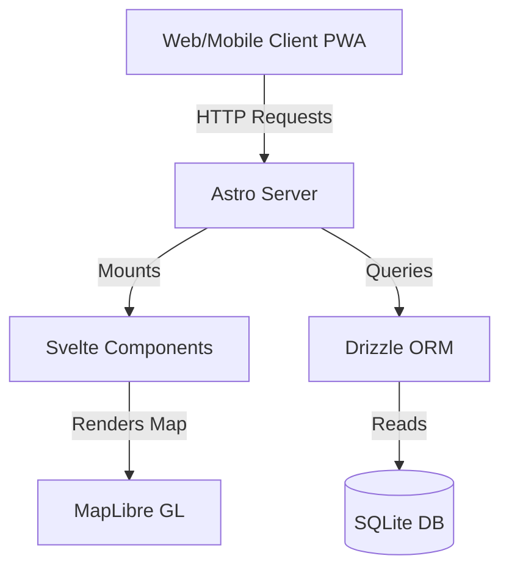

# Room TBA - UPLB Room Finder


A web app to help UPLB students find rooms on campus. "Saan sa UPLB ang \_\_\_?" Finally answered.

## Features

- Search rooms by name, building, college, division
- Filter rooms by Building, College, or Division
- View room schedules with visual timetable display
- Building information with directions and **MapLibre GL / OpenStreetMap** integration
- Room-specific directions for commonly asked-about rooms
- Mobile-responsive design with accessibility features
- **Offline support (PWA)** in cases where data is not accessible on campus

## Data

Course and room listings are maintained for UPLB students and updated each term; they currently reflect 2nd Semester AY 2025–2026. Data is managed using **Drizzle ORM** with **SQLite**.

## Development/Contribution

To run locally, you need to download [Bun.js](https://bun.sh/) and run the following command:

```bash
bun install
bun dev
```

The data is stored in the `info.db` file, and may be accessed using sqlite. If you are not familiar with using SQL, you may run the following command to open up drizzle studio and start correcting data:

```bash
bunx drizzle-kit studio
```

After that, you may open a pull request and describe the changes.

## System Architecture



## Releases and versioning

Versions follow [Semantic Versioning](https://semver.org/). [semantic-release](https://semantic-release.gitbook.io/) runs on every push to `main` (skipping commits that include `[skip ci]`). It reads [Conventional Commits](https://www.conventionalcommits.org/) messages, bumps `package.json`, updates `CHANGELOG.md`, creates a Git tag, and publishes a GitHub release.

Use prefixes such as `fix:`, `feat:`, or `feat!:` / `BREAKING CHANGE:` so the next version is chosen correctly. To preview what would ship without changing anything:

```bash
bun run release:dry
```

The footer and status bar show `v{version}` from `package.json` at build time.

## License

[MIT License](LICENSE)

## Author

Developed by [Simonee Ezekiel Mariquit](https://stimmie.dev)

## Contributors

- **Niño Anthony Marmeto** - Helped with Electrical Engineering building information
- **Rosh Almario** - Helped with Institute of Chemistry room directions
- **Ken Ramiscal** - Helped with Developing the UI, offline support, and map functionalities
- **Kalinaw Lukas Aom Bebis** - Helped with developing the UI, bug fixing, and map functionalities
- **Eunice Almeyda** - Logo Designer
- **Mary Gwyneth Telmosa** - UI Designer


---
*If this project helped you out, consider [treating me to a coffee](https://kape.stimmie.dev) ☕*

## 📊 Current State of the Code
- **Tech Stack:** React, Astro, Svelte, Node.js/NPM
- **Repository Size:** 109 tracked files
- **Latest Update:** `d211303 chore: add stale issue and PR validators`
