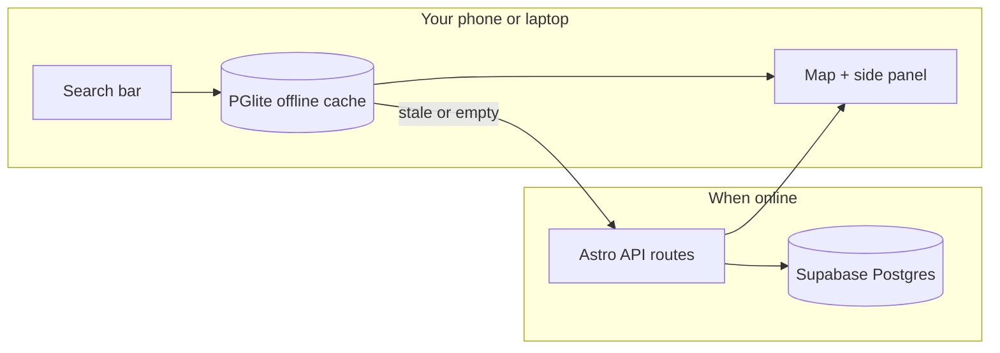
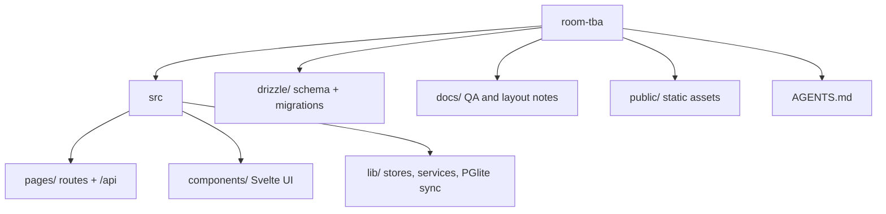

<div align="center">

# Room TBA

**Saan sa UPLB ang \___?**

[](https://room-tba.uplb.tools)
[](LICENSE)
[](https://bun.sh)
[](https://astro.build)

_Schedules, buildings, jeepney routes, and "where is PSLH 1?" on one campus map._

[Open the map](https://room-tba.uplb.tools) · [Wiki](https://room-tba.uplb.tools/wiki) · [FAQ](https://room-tba.uplb.tools/faq) · [Report wrong data](https://github.com/uplbtools/room-tba/issues/new/choose) · [Changelog](https://room-tba.uplb.tools/changelog)

</div>

---

## What this is

**Room TBA** is a map-first web app for [UPLB](https://uplb.edu.ph) students. You search a room code, building nickname, or course; the app puts it on an interactive campus map, shows schedules when we have them, and keeps working when the signal drops.

No account needed to browse. Editors and contributors fix data in the same app (login popup on the map, not a separate admin site).

## By the numbers

- **58 buildings** and their rooms mapped, searchable, and routable on one campus map
- **94,000+ class sections** imported across **9 academic terms** (AY 2023 to present)
- **~21,000 page views** in the 30 days to Aug 2026, measured during term break (Vercel Analytics; peaks land in enlistment and exam weeks)
- **20 contributors**, 30+ tagged releases, and a [good-first-issue queue](https://github.com/uplbtools/room-tba/issues?q=is%3Aissue+is%3Aopen+label%3A%22good+first+issue%22) for student developers
- Campus map data published as **open data** under [CC-BY 4.0](https://creativecommons.org/licenses/by/4.0/)
- Serving [UPLB](https://uplb.edu.ph), a campus of roughly 12,000 students, and built to be [forked for other campuses](#fork-this-for-your-campus)

> **Data note:** Room and class listings are updated each term by volunteers. The active term follows the academic calendar (midyear Jun–Jul, 2nd sem Jan–May, etc.). **Class search** lists lecture, lab, thesis, special problem, and similar sections; ones without a room in AMIS show as unassigned. **Room schedules** list only lecture and lab sections with assigned rooms. Wrong schedule? [Open an issue](https://github.com/uplbtools/room-tba/issues/new/choose).

---

## What you can do

| Goal | How |
| ----------------------------- | ---------------------------------------------------------------- |
| Find **PSLH 1** or **PhySci** | Search + aliases (`PhySci`, `HUM`, …) |
| Room schedule this sem | Term filter + timetable |
| Personal schedule route | Build a plan in Planner → Map tools → Schedule → pick a day, route stops |
| Browse all classes | Status bar → Browse classes; search by course code |
| Section with no room yet | "No assigned room" rows hint the offering department and where the course usually meets (#846) |
| Plan your classes | Planner view to build a draft schedule |
| What do I have today | Today view (`/today`): your plan's classes for today, tomorrow, and the rest of the week; one tap routes the day on the map with total walking time and distance (`/today?route=1`) |
| Course Planner explainer | [Four-panel, screenshot-ready guide](https://room-tba.uplb.tools/pubmat/course-planner/) |
| Final exam time & room | Search course code → finals panel; room panel during finals week |
| Academic calendar | [/calendar](https://room-tba.uplb.tools/calendar) — term windows on a year timeline; also via the term picker |
| Building location | Map, pins, directions, Google Maps |
| Compare dorm listings | Verified dorms link to their Kubo listing when available |
| Landmarks, services, orgs & offices | Sidebar directories, distinct map pins, and shareable detail links |
| Offline / bad signal | PWA + local cache; tiles if already loaded |
| Campus events | Events on map with routes |
| Jeepney routes | Route overlays |
| Walking time from a point | Map tools → Travel time; tap the map, paths color by minutes |
| Measure a route | Map tools → Measure route; drop waypoints, get walk / cycle / car times |
| 3D view | Buildings + Makiling terrain (online) |
| Common questions | [Student FAQ](https://room-tba.uplb.tools/faq) (3D models, data sources, offline) |
| Tell us something is wrong | Settings → Feedback; free text, optional contact, or reach the team on Messenger / Discord |
| Understand section names | Wiki guide to the A–H / S–Z class time blocks |

<details>
<summary><strong>Editor / contributor mode</strong> (password from the team)</summary>

| Power | Where |
| -------------------------------- | ---------------------------------------------------------------------------------------------------------------- |
| Move building & dorm pins | Map edit mode (pencil) |
| Add or correct landmarks, services, organizations, offices & units | **Add something to the map** or the side-panel editor; pick the map pin |
| Fix room/building/college copy | Side panel → Edit |
| Suggest edits without publishing | **Suggest an edit** → admin review queue |
| Upload event posters | Event editor + R2 image upload (when configured) |
| Manage public credit | Account settings → optional HTTPS avatar/profile link; uncheck credits to opt out |
| Undo a pin drag | Toolbar undo/redo (session); durable history tracked in [#202](https://github.com/uplbtools/room-tba/issues/202) |

Login: **`/?editor=login`** or the shield / status bar in the app. `/admin` URLs redirect back into the map.

</details>

---

## How a search works


```mermaid
flowchart LR
  subgraph browser [Your phone or laptop]
    Search[Search bar]
    PGlite[(PGlite offline cache)]
    Map[Map + side panel]
  end
  subgraph cloud [When online]
    API[Astro API routes]
    DB[(Supabase Postgres)]
  end
  Search --> PGlite
  PGlite -->|stale or empty| API
  API --> DB
  API --> Map
  PGlite --> Map
```

1. **First visit online:** app syncs buildings, rooms, classes, aliases, and events into browser storage.
2. **You search:** local data first; network when sync keys say something changed.
3. **You pick a result:** map flies to the pin; side panel shows schedules, directions, and a share link.
4. **You go offline:** last sync still answers "saan ang room na 'to?" (map tiles need a prior download or visit).

---

## Stack

- [Astro 7](https://astro.build) + [Svelte 5](https://svelte.dev)
- [Bun](https://bun.sh)
- [Supabase](https://supabase.com) Postgres + [Drizzle](https://orm.drizzle.team) (`drizzle/`)
- [PGlite](https://pglite.dev) in the browser for offline data
- [MapLibre GL](https://maplibre.org), OSM / MapTiler tiles
- [Vercel](https://vercel.com) for SSR and API routes
- Cloudflare R2 for event uploads (optional)

Contributor notes: [AGENTS.md](AGENTS.md)

---

## Run it locally

### You need

- [Bun](https://bun.sh) 1.3+
- A **Supabase** Postgres URL (`DATABASE_URL`); session pooler recommended for dev
- `ADMIN_PASSWORD` if you want editor login locally
- `ISR_BYPASS_TOKEN` (optional locally; **required on Vercel** for on-demand SEO page revalidation after editor publishes)

### Setup

```sh
git clone https://github.com/uplbtools/room-tba.git
cd room-tba
cp .env.example .env.local
# Fill DATABASE_URL (staging pooler) and ADMIN_PASSWORD; see .env.example for prod/E2E URLs

bun install
bun dev
```

Open **http://localhost:4321**. Without `DATABASE_URL`, the dev server starts but pages that hit the DB will 500. That is expected.

To test the optional Kubo dorm link, the CTA directory loads lazily from Kubo
through Room TBA's cached proxy and starts empty, so no button appears until the
API confirms a matching Room TBA dorm ID. Set `KUBO_ROOM_TBA_DIRECTORY_URL` to
a local fixture server to test **Reserve on Kubo**, **Join waitlist on Kubo**,
**View on Kubo**, and an unmapped dorm without Kubo production access.

### Linting and formatting

This project uses [Biome](https://biomejs.dev/) for both formatting and linting (replacing Prettier and ESLint).

```sh
# Check format + lint (no writes):
bun run lint

# Auto-fix all safe issues:
bun run lint:fix

# Format only:
bun run format
```

Install the [Biome VS Code extension](https://marketplace.visualstudio.com/items?itemName=biomejs.biome) for format-on-save support. The workspace settings in `.vscode/settings.json` configure this automatically.

### Commands worth knowing

| Command | Does what |
| --- | --- |
| `bun dev` | Dev server |
| `bun run build` | Production build (**needs** `DATABASE_URL`; entity SEO pages render on first request via Vercel ISR, not at build) |
| `bun test src/lib src/constants` | Unit + store tests (no DB required) |
| `bun run test:components` | Vitest component/layout tests |
| `bun run test:integration` | API + DB integration (E2E DB; see `docs/testing.md`) |
| `bun run e2e` | Playwright blocking suite (uses `serve:e2e`: node adapter build + preview) |
| `bun run e2e:advisory` | Playwright advisory (non-blocking in CI) |
| `bun run lint` | Biome check (format + lint) |
| `bun run lint:fix` | Biome check with auto-fixes |
| `bun run format` | Biome format write |
| `bunx drizzle-kit studio` | Browse/edit Postgres visually |
| `bun run seed:aliases` | Seed building aliases from `public/room_info.json` |
| `bun scripts/build-walk-graph.ts <graphml>` | Rebuild `src/generated/walk-graph.json` from an osmnx GraphML export (travel-time tools) |
| `bun run seed:deep-research` | Fill-only data-gap seed from the 2026-07 research report (`DATABASE_URL`; `--dry-run` supported) |
| `bun run generate:pglite-schema` | Regenerate the offline PGlite init SQL from `drizzle/schema.ts` |
| `bun run import:osa-orgs` | Add the current public OSA organization directory (`DATABASE_URL`; safe to rerun) |
| `bun run import:campus-offices` | Add missing campus offices and units (`DATABASE_URL`; safe to rerun) |
| `bun run import:amis-classes` | Upsert AMIS classes (`docs/amis-com-refresh-runbook.md`) |
| `bun run backfill:acad-orgs` | Rerun the AMIS import over the 9 cached term JSONs to fill `classes.acad_group`/`acad_org` (#846) |
| `bun run import:final-exams` | Import OUR finals JSON into Postgres (`DATABASE_URL`; see `docs/final-exams-data-source.md`) |
| `bun run audit:campus-data` | Read-only sweep for wrong pins, scattered tenants, missing building links and orphan rooms (`PROD_DATABASE_URL`; writes nothing) |
| `bun run record:bulk-history` | Record `editor_history` rows for a maintenance/bulk data operation (`DATABASE_URL`; dry run unless `--apply`; see `docs/bulk-data-history.md`) |
| `bun run backfill:bulk-history` | One-off: backfill history for the 2026-08-03/04 direct-database corrections (`DATABASE_URL`; dry run unless `--apply`) |

Legacy **`data/info.db`** SQLite is only for old seed/export scripts (`bun:sqlite`, not runtime). Production uses Supabase Postgres via `DATABASE_URL`. Archived SQLite migrations live in `drizzle-migrations/`: do not edit; active schema is `drizzle/`.

Optional env vars (R2 uploads, Supabase Auth client): see [`.env.example`](.env.example). Staging vs production: set `PUBLIC_APP_ENV=staging` on Vercel Preview and local dev; production uses `production` (default) and hides the staging banner.

---

## Repo map


```mermaid
flowchart TB
  root[room-tba]
  root --> src
  root --> drizzle["drizzle/ schema + migrations"]
  root --> docs["docs/ QA and layout notes"]
  root --> public["public/ static assets"]
  root --> agents[AGENTS.md]
  src --> pages["pages/ routes + /api"]
  src --> components["components/ Svelte UI"]
  src --> lib["lib/ stores, services, PGlite sync"]
```

Deep editor QA: [`docs/editor-foundation-test-plan.md`](docs/editor-foundation-test-plan.md) 
PR checklist: [`docs/agentic-qa-process.md`](docs/agentic-qa-process.md)

---

## Contributing

See **[CONTRIBUTING.md](CONTRIBUTING.md)** for how to help:

- **Report wrong data** or **campus QA:** no clone, no PR
- **Write code:** branch off `staging`, PR to `staging` ([developer guide](docs/developer-guide.md))
- **Maintainers / agents:** [AGENTS.md](AGENTS.md) · [agent tooling](docs/agent-tooling.md) (`bun run install:agent-tooling` + `install:agent-plugins` once per machine)

[Good first issues](https://github.com/uplbtools/room-tba/issues?q=is%3Aissue+is%3Aopen+label%3A%22good+first+issue%22) · **Data:** label `data` · **QA:** label `qa` · **Chat with the team:** [Messenger](https://messenger.uplbtools.me/contribute)

Implementers: [issue hygiene](docs/issue-hygiene.md) · [PR QA process](docs/agentic-qa-process.md)

---

## Releases

Version follows semver. Pushes to `main` run [semantic-release](https://semantic-release.gitbook.io/) (skip with `[skip ci]` in the commit message). The in-app status bar shows `vX.Y.Z` from `package.json`.

Dry run: `bun run release:dry`

---

## Credits

**Maintainer:** [Simonee Ezekiel Mariquit](https://stimmie.dev)

**Built with help from:**

| Person | Helped with |
| ----------------------- | -------------------------------------- |
| Ken Ramiscal | UI, offline support, map |
| Kalinaw Lukas Aom Bebis | UI, bug fixes, map |
| Niño Anthony Marmeto | Electrical Engineering building info |
| Rosh Almario | Institute of Chemistry room directions |
| Eunice Almeyda | Logo |
| Mary Gwyneth Telmosa | UI design |

Org: [uplbtools](https://github.com/uplbtools) · Campus tool, not an official UPLB product.

---

## Sponsors

Room TBA is funded by curated campus-relevant sponsors and one-time donations. Revenue supports core team incentives (40%), contributor payouts (30%), and operational expenses (30%).

**[Donate](https://room-tba.uplb.tools/donate)** · **[Become a sponsor](https://room-tba.uplb.tools/sponsors)** · [Funding model](docs/funding-model.md) · [Ad policy](docs/ad-policy.md)

---

## Fork this for your campus

MIT lets you fork this and run it for a different school. This is not a "swap the logo and ship" fork — a lot of the app is UPLB data and UPLB-specific glue. You keep the engine (map UI, search, offline cache, editor, planner, the Drizzle schema) and replace the UPLB parts.

Full guide with every file path and the painful parts: **[Fork this for your campus](https://room-tba.uplb.tools/wiki/fork-for-your-campus)** in the wiki. For the config file, start with the **[fork wizard](https://room-tba.uplb.tools/fork)** — point a map at your campus and it generates `src/campus.config.ts` plus a Vercel deploy link.

Start with `bun run fork:init` — it asks for your campus name, URL, map center/bounds/zoom, and whether you want the 3D terrain and transit overlays, then rewrites `src/campus.config.ts` for you (refuses a dirty git tree unless `--force`).

**See it working first:** `bun run seed:sample` loads a small fictional campus (6 buildings, 12 rooms, 2 terms of classes) into an empty database so the app runs before you have any real data, and `bun run import:classes-generic -- your-classes.csv` imports your registrar's export from a documented flat CSV/JSON shape. Walkthrough: [docs/fork-data-guide.md](docs/fork-data-guide.md).

The short version of what you replace:

| File | What to change |
| --- | --- |
| `src/campus.config.ts` | **The single config file** (`bun run fork:init` writes it). Site name, URL, title, description, map center/bounds/camera, terrain (`campusTerrain.enabled` off = flat map), transit overlay (`campusTransit.enabled` + menu label), E2E fixture coordinates, community links. The files below import from here. |
| `public/room_info.json` | UPLB building seed → your buildings |
| `src/constants/jeepney-routes.ts` + geometries | Your transit routes/stops, or set `campusTransit.enabled: false` to hide the overlay everywhere |
| `src/generated/walk-graph.json` | UPLB path network (travel-time tools). Rebuild from your campus's OSM extract: `bun scripts/build-walk-graph.ts <your-osmnx-export.graphml>`; speeds in `src/constants/travel-modes.ts`. |
| `scripts/import-amis-classes.ts` and friends | UPLB data sources (AMIS, OUR finals, OSA). Use `bun run import:classes-generic` with your registrar's export instead ([guide](docs/fork-data-guide.md)). |
| Supabase DB contents | Every row is UPLB. Schema stays; data goes. |

The hard part is class schedules. Room TBA pulls from AMIS, which is UPLB's system. You do not have AMIS — flatten whatever your registrar gives you into the generic importer's CSV/JSON shape ([docs/fork-data-guide.md](docs/fork-data-guide.md)) and rerun it each term. `data/sample-campus/classes.csv` is the worked example.

After you think you've replaced everything, run `bun run fork:check` — it scans for hardcoded UPLB strings you missed and reports file:line hits. Wire it into your fork's CI so a stray UPLB string does not sneak back in on a merge from upstream.

---

## License

| Layer | License |
| --- | --- |
| Application code | [MIT](LICENSE) |
| Community campus map data (buildings, rooms, dorms, orgs, pins, aliases) | [CC-BY 4.0](https://creativecommons.org/licenses/by/4.0/) |
| OpenStreetMap basemap / footprints | [ODbL](https://www.openstreetmap.org/copyright) (+ [MapTiler](https://www.maptiler.com/copyright/) for tiles) |
| AMIS/CRS, OUR, OSA imports | Not offered under an open bulk license |

Use the code, fork it, teach with it. If you deploy a fork for another campus, change the data, not just the logo. See the [fork guide](#fork-this-for-your-campus) above. Student-facing summary: [FAQ — Can I reuse Room TBA data?](https://room-tba.uplb.tools/faq#data-license).

---

<div align="center">

**[room-tba.uplb.tools](https://room-tba.uplb.tools)**

</div>
