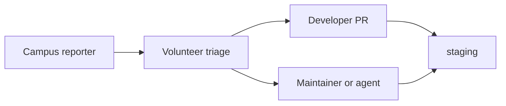

# Volunteer triage

Lightweight process for non-coding volunteers and triage leads. You do **not** need [AGENTS.md](../AGENTS.md).

## Weekly check (5–10 minutes)

1. Open [open issues](https://github.com/uplbtools/room-tba/issues).
2. Sort by **`data`** and **`qa`** labels — campus reports.
3. For each new issue:
   - Is the report clear enough to act on? If not, ask one clarifying question in a comment.
   - Add **`help wanted`** if it needs a developer and no one is assigned.
   - Link related duplicates.
4. Skim **`good first issue`** — ping Discord if something is unclaimed for 2+ weeks.

## Who does what

| Role               | Action                                                |
| ------------------ | ----------------------------------------------------- |
| Reporter           | Data / QA issue or in-app suggest — **no PR**         |
| Triage             | Label, clarify, surface `help wanted`                 |
| Developer          | Picks up issue, PR to `staging`, comments on issue    |
| Maintainer / agent | Same; may implement data fixes on behalf of reporters |

## Credit

- Thank reporters in issue comments when a fix merges.
- Contributor profiles (#310) will extend this later.

## Templates

| Template                                                         | Use                             |
| ---------------------------------------------------------------- | ------------------------------- |
| [Data correction](../.github/ISSUE_TEMPLATE/data_correction.yml) | Wrong schedule, pin, directions |
| [Campus QA](../.github/ISSUE_TEMPLATE/campus_qa.yml)             | Manual testing on device        |

Full contributor paths: [CONTRIBUTING.md](../CONTRIBUTING.md).

Epic: [#217](https://github.com/uplbtools/room-tba/issues/217).
